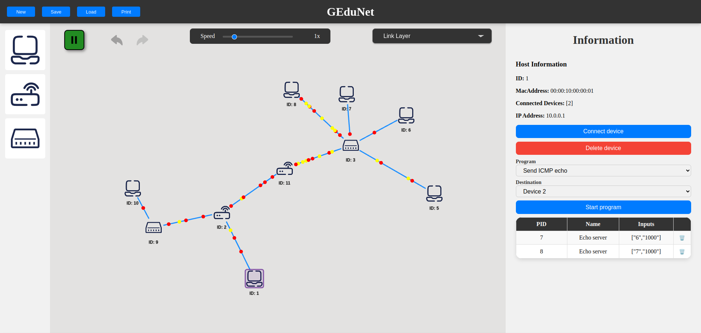
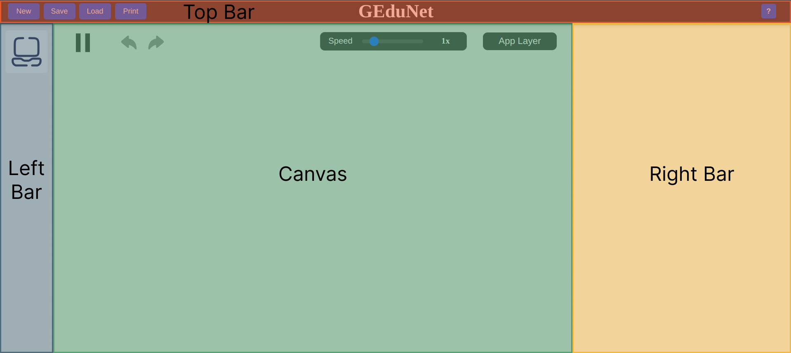
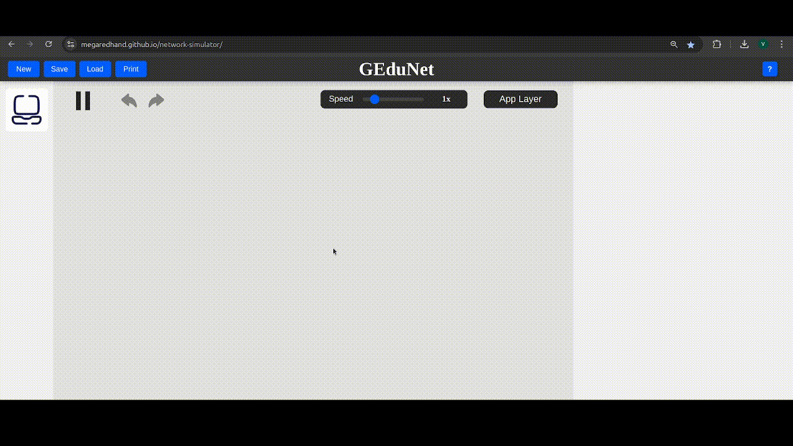

# GEduNet 🌐

_GEduNet_ is an Graphical Educational Computer Network Simulator.
It's meant as an aid to students trying to understand computer networks, along with their teachers.

The project runs on the browser and is hosted in GitHub Pages.
You can access it [here](https://megaredhand.github.io/network-simulator/).

# Gedunet User Manual

## Getting Started

Welcome to the GEduNet simulator! This application is designed to help you visualize and understand computer networks.

GEduNet consists of 4 main components on screen:
1. Right bar: Shows information about the selected device.
2. Left bar: Contains buttons to add devices to the network.
3. Canvas: The main area where the network is displayed.
4. Top bar: Contains the simulation file controls, help and settings.

### Left Bar
The left bar contains buttons to add devices to the network. You can add the following devices:

- **Host**: A computer or device that connects to the network.
- **Router**: A device that forwards data packets between computer networks.
- **Switch**: A device that connects devices within a single network and uses MAC addresses to forward data to the correct destination.

In order to add a device, just click on the corresponding button and the selected device will appear in the center of the canvas.
Depending on the selected layer, different devices will be added.

### Right Bar

### Top Bar

### Canvas

## Development

To run the local development server, use `npm run start`

For building the artifacts, use `npm run build`

For checking code format and lint, use `npm run lint`
