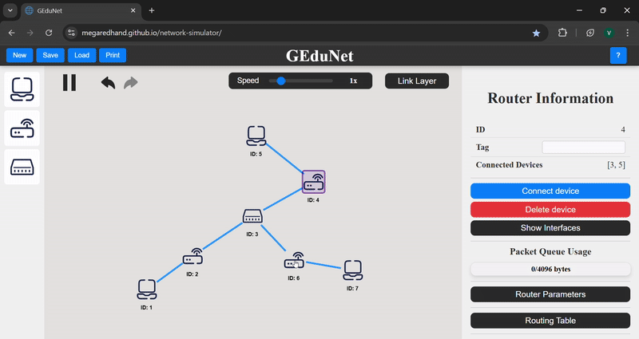
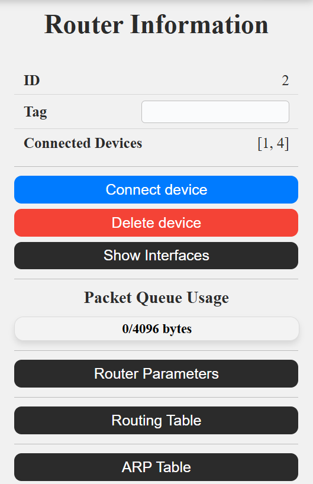
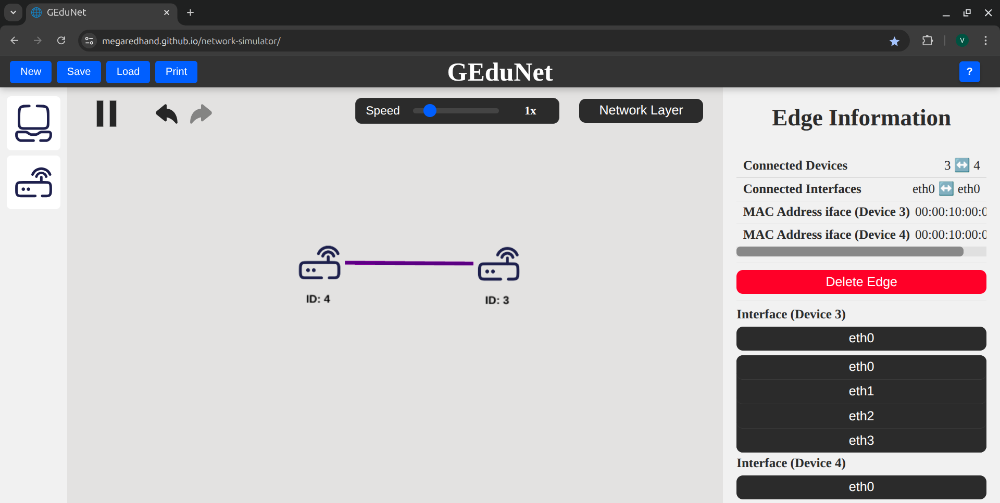

# GEduNet 🌐

_GEduNet_ is an Graphical Educational Computer Network Simulator.
It's meant as an aid to students trying to understand computer networks, along with their teachers.

The project runs on the browser and is hosted in GitHub Pages.
You can access it [here](https://megaredhand.github.io/network-simulator/).

# **GEduNet - User Manual** 📘

- [GEduNet 🌐](#gedunet-)
- [**GEduNet - User Manual** 📘](#gedunet---user-manual-)
  - [Getting Started](#getting-started)
    - [Left Bar](#left-bar)
    - [Right Bar](#right-bar)
    - [Top Bar](#top-bar)
    - [Canvas](#canvas)
  - [Devices and Edges](#devices-and-edges)
    - [Host](#host)
      - [Host Information](#host-information)
      - [Host Hover](#host-hover)
    - [Router](#router)
      - [Router Information](#router-information)
      - [Router Hover](#router-hover)
    - [Switch](#switch)
      - [Switch Information](#switch-information)
      - [Switch Hover](#switch-hover)
    - [Edge](#edge)
      - [Edge Information](#edge-information)
      - [Edge Hover](#edge-hover)
      - [Devices Interfaces](#devices-interfaces)
  - [Programs](#programs)
    - [ICMP echo](#icmp-echo)
    - [Echo Server](#echo-server)
    - [Send and Serve HTTP Requests](#send-and-serve-http-requests)
    - [ARP Request](#arp-request)
  - [Packets](#packets)
    - [Packet Speed and Pause](#packet-speed-and-pause)
    - [ICMP Packet](#icmp-packet)
    - [HTTP Packet](#http-packet)
    - [TCP Packet](#tcp-packet)
    - [ARP Packet](#arp-packet)
  - [Tables](#tables)
    - [Routing Table](#routing-table)
    - [Switch Table](#switch-table)
    - [ARP Table](#arp-table)
  - [Misc](#misc)
    - [Shortcuts](#shortcuts)
    - [Settings](#settings)
    - [Loading and Saving](#loading-and-saving)
    - [Print Canvas](#print-canvas)
- [Development](#development)

## Getting Started

Welcome to the GEduNet simulator! This application is designed to help you visualize and understand computer networks.

GEduNet consists of 4 main components on screen:

1. Right bar: Shows information about the selected device.
2. Left bar: Contains buttons to add devices to the network.
3. Canvas: The main area where the network is displayed.
4. Top bar: Contains the simulation file controls, help and settings.

### Left Bar

The left bar contains buttons to add devices to the network. You can add the following devices:

- **Host**: A computer or device that connects to the network.
- **Router**: A device that forwards data packets between computer networks.
- **Switch**: A device that connects devices within a single network and uses MAC addresses to forward data to the correct destination.

In order to add a device, just click on the corresponding button and the selected device will appear in the center of the canvas.

  

Depending on the selected layer, different devices will be added to the leftbar. This is to properly distinguish which devices
are involved on the different layers.
The device distribution is as follows:

- **App Layer**: Host
- **Transport Layer**: Host
- **Network Layer**: Host and Router
- **Link Layer**: Host, Router and Switch

### Right Bar

The right bar shows information about the selected device. This information varies depending on the type of device selected and
the chosen layer. This section also shows data of the network edges and packets.

To see the information of a device, edge or packet, just click on it and the right bar will update to show the information of the selected device.

  

### Top Bar

This section contains the simulation file controls. This includes the following buttons:

- **New**: Reset the current network to its initial state.
- **Save**: Save the current network to a JSON file.
- **Load**: Load a network from a JSON file of your own.
- **Print**: Take a snapshot of the current network and save it as a .png image.

On the right side of the top bar, you can find the help button. This button will open a modal with a list of different shortcuts
and some configuration options.

  

### Canvas

This is the main area where the network is displayed. You can drag devices to move them around the canvas and zoom in and out using the mouse wheel.

There are also some controls of the packet simulation, which are located on the top of the canvas. These controls are:

- **Play/Pause**: Start or stop the packet flow on the network.
- **Undo/Redo**: Undo or redo the last action in case you made a mistake.
- **Packet Speed Wheel**: Change the speed of the packets on the network. This is a slider that sets a multiplier to the speed of the packets. The default value is 1, which means that the packets will be sent at normal speed. You can set it up to 0.5 to slow down the packets or up to 4 to speed them up.
- **Layer Dropdown**: Change the layer of the network. When selecting a new layer, the network and the simulator functionalities will change as well. Setting a new layer may change:

  - The devices that can be added to the network.
  - The information shown in the right bar.
  - The packets shown in the network.
  - The devices visible in the network.

  This creates a focused view that will help you understand each networking layer independently.

The available layers are:

- App Layer
- Transport Layer
- Network Layer
- Link Layer

  

  

This introductory information is also shown on the right bar when nothing is selected.

## Devices and Edges

### Host

  

A host is a computer or device that connects to the network. It can send and receive data packets. In the simulator, a host can be used to represent a computer, a server or any other endpoint that connects to the network.

In the simulator, a host is visible on all layers. Given the fact that hosts are endpoints, they can't be abstacted to a specific layer. Hosts are involved on every layer.

#### Host Information

  

The information shown in the right bar when selecting a host is as follows:

- **ID**: The ID of the host. This is a simulated unique identifier for the host in the network.
- **Connected Devices**: The devices that are directly connected to this host through edges.
- **MAC Address**: The MAC address of the host. This is only visible in the Link Layer.
- **IP Address**: The IP address of the host. This is always visible.
- **Connect Device Button**: This button allows you to connect the host to another device. First press the Connect Device button and then click on the device you want to connect to. This will create an edge between the two devices. You can only connect
  devices if the host and the other device have free interfaces.
When you connect a host to another device, it will link the first two unused interfaces of each device. You can change the interfaces used to connect the devices by selecting the [edge](#devices-interfaces) that connects them.
- **Delete Device Button**: This button allows you to delete the host from the network. This will also delete all edges connected to this host.
- **Program Runner Section**: This section includes a dropdown to select a program and a second button to start the program after
  selecting the program inputs.
- **ARP Table**: This table shows the translation of the different IP Adresses translations into MAC Adresses. It also allows to edit and refresh these translations.

#### Host Hover

Hovering on a Host will show the IP address. If the simulator is set on the Link Layer, it will also show the MAC address.

  

### Router

  

A router is a device that forwards data packets between computer networks. It is used to connect different networks and route data between them.

In the simulator, the routers are visible from the Network layer downward. Routers act as intermediaries between different networks and are responsible for routing data packets to their destination. But they are not particularly involved in the App and Transport layers.

#### Router Information

  

The information shown in the right bar when selecting a router is as follows:

- **ID**: The ID of the router. This is a simulated unique identifier for the router in the network.
- **Connected Devices**: The devices that are directly connected to this router through edges.
- **MAC Address**: The MAC address of the router. This is only visible in the Link Layer.
- **IP Address**: The IP address of the router. This is always visible.
- **Connect Device Button**: This button allows you to connect the router to another device. First press the Connect Device button and then click on the device you want to connect to. This will create an edge between the two devices. You can only connect
  devices if the host and the other device have free interfaces. 
When you connect a router to another device, it will link the first two unused interfaces of each device. You can change the interfaces used to connect the devices by selecting the [edge](#devices-interfaces) that connects them.
- **Delete Device Button**: This button allows you to delete the router from the network. This will also delete all edges connected to this router.
- **Packet Queue Usage Bar**: This bar shows the usage of the packet queue of the router. The packet queue is used to store packets that are waiting to be processed by the router. The bar shows the percentage of the queue that is currently in use. If the queue is full, the router will drop packets until there is space in the queue.
- **Router Parameters Dropdown**: This dropdown allows you to select the parameters of the router. The parameters are:
  - **Packet Queue Size [bytes]**: The amount of bytes that the router can store in its queue. This is the maximum size of the queue. The default value is 1024 bytes.
  - **Packet Processing Speed [ms/byte]**: The time it takes for the router to process a packet. The default value is 8 miliseconds.
- **Routing Table**: The routing table is a data structure used by routers to determine the best path for forwarding packets to their destination. It contains the IP, the Nework Mask and the selected interface. You can edit the entries of the table to fit your desired routing scheme. You can also restore the default state of the table by pressing the reset button on the top right corner.
- **ARP Table**: This table shows the translation of the different IP Adresses translations into MAC Adresses. It also allows to edit and refresh these translations.

#### Router Hover

Hovering on a Router will show the IP address. If the simulator is set on the Link Layer, it will also show the MAC address.

  

### Switch

  

A switch is a device that connects devices within a single network and uses MAC addresses to forward data to the correct destination. It is used to connect devices on a local area network (LAN) and is responsible for forwarding data packets between those devices.

In the simulator, the switches are only in the Link Layer. As switches are used to connect devices within a single network, they are not involved in the use of endpoints or routing data between different networks.

> ⚠️ Aclaración de la simplificación de LANs en el simulador

#### Switch Information

  

The information shown in the right bar when selecting a switch is as follows:

- **ID**: The ID of the switch. This is a simulated unique identifier for the switch in the network.
- **Connected Devices**: The devices that are directly connected to this switch through edges.
- **MAC Address**: The MAC address of the switch.
- **Connect Device Button**: This button allows you to connect the switch to another device. First press the Connect Device button and then click on the device you want to connect to. This will create an edge between the two devices. You can only connect
  devices if the host and the other device have free interfaces.
When you connect a switch to another device, it will link the first two unused interfaces of each device. You can change the interfaces used to connect the devices by selecting the [edge](#devices-interfaces) that connects them.
- **Delete Device Button**: This button allows you to delete the switch from the network. This will also delete all edges connected to this switch.
- **Switching Table**: This table shows the MAC Address and the port in which that Address is assigned.
  This table is used by the switch to forward data packets to the correct destination. You can edit the entries of the table to fit your desired switching scheme. You can also restore the default state of the table by pressing the reset button on the top right corner.

#### Switch Hover

Hovering on a Switch will show the MAC address.

  

### Edge

In the simulator, and edge represents a connection between two devices. Packets travel through edges to reach their destination.
If a device stops being visible while changing layers, the respective edges will also stop being visible.

  

However, if the device that stops being visible in one layer is in the middle of two visible devices, the edges will still be visible and the device will be replaced with a **dot**. This **dot** will not be selectable and will not show any information when hovered. It is just a placeholder to show that there is a connection between the two devices. Besides, it lets you manipulate the network more easily.

  

#### Edge Information

  

The information shown in the right bar when selecting an edge that conects two devices is as follows:

- **Connected Devices**: The IDs of the devices that are connected by this edge.
- **Connected Interfaces**: The interfaces that are used to connect the two devices.
- **MAC Address Interface of Device 1**: The MAC address of the interface of the first device.
- **MAC Address Interface of Device 2**: The MAC address of the interface of the second device.
- **Delete Edge Button**: This button allows you to delete the edge from the network.
- **Device 1 Interface Dropdown**: This dropdown allows you to select the interface that the first device will use to connect to the second device.
- **Device 2 Interface Dropdown**: This dropdown allows you to select the interface that the second device will use to connect to the first device.

If there is a dot in the middle of the edge, it would not be clear which device is the first and which is the second. In this case, the whole path will be selected and it will show the devices connected by that path. If you want to see more information about one of those specific edges, you will have to change the current layer.

  

#### Edge Hover

While hovering over an edge, it will show the interfaces that each device use to communicate with each other. This way you can
see how the devices are connected.

#### Devices Interfaces
When you select an edge that connect two devices, you will see a dropdown menu to select which interface of each device you want to use to connect those devices. Each type of device has a fixed limited amount of interfaces. Hosts have 2 interfaces, Routers have 4 and Switches have 8. 

  
  
  

## Programs

### ICMP echo

### Echo Server

### Send and Serve HTTP Requests

### ARP Request

## Packets

### Packet Speed and Pause

### ICMP Packet

### HTTP Packet

### TCP Packet

### ARP Packet

## Tables

### Routing Table

### Switch Table

### ARP Table

## Misc

### Shortcuts

### Settings

### Loading and Saving

### Print Canvas

# Development

To run the local development server, use `npm run start`

For building the artifacts, use `npm run build`

For checking code format and lint, use `npm run lint`
