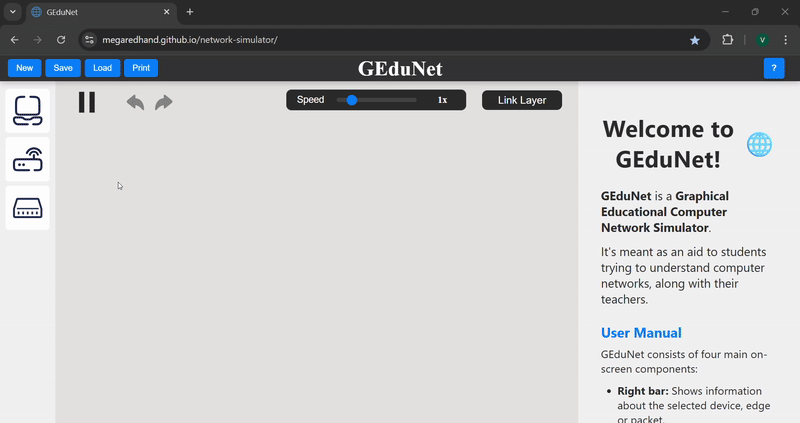
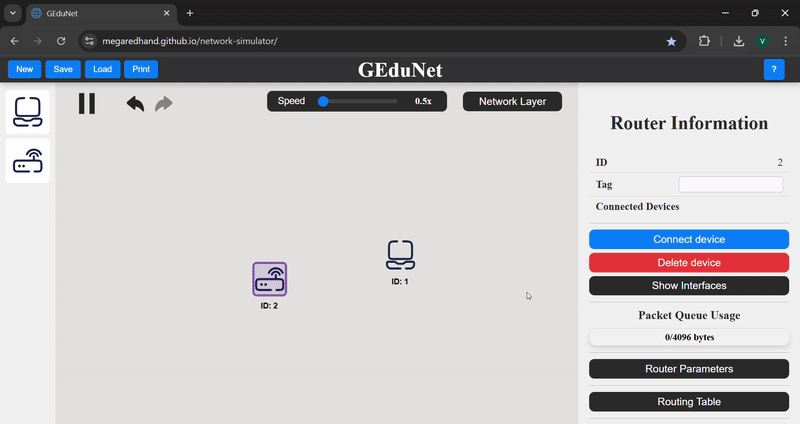
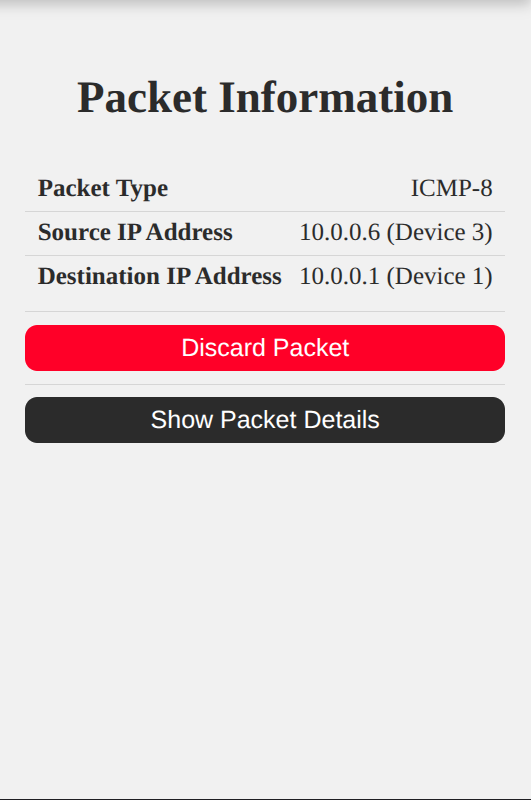

# GEduNet 🌐

_GEduNet_ is an Graphical Educational Computer Network Simulator.
It's meant as an aid to students trying to understand computer networks, along with their teachers.

The project runs on the browser and is hosted in GitHub Pages.
You can access it [here](https://megaredhand.github.io/network-simulator/).

# **GEduNet - User Manual** 📘

- [GEduNet 🌐](#gedunet-)
- [**GEduNet - User Manual** 📘](#gedunet---user-manual-)
  - [Getting Started](#getting-started)
    - [Left Bar](#left-bar)
    - [Right Bar](#right-bar)
    - [Top Bar](#top-bar)
    - [Canvas](#canvas)
  - [Devices and Edges](#devices-and-edges)
    - [Host](#host)
      - [Host Information](#host-information)
      - [Host Hover](#host-hover)
    - [Router](#router)
      - [Router Information](#router-information)
      - [Router Hover](#router-hover)
    - [Switch](#switch)
      - [Switch Information](#switch-information)
      - [Switch Hover](#switch-hover)
    - [Edge](#edge)
      - [Edge Information](#edge-information)
      - [Edge Hover](#edge-hover)
      - [Devices Interfaces](#devices-interfaces)
  - [Programs](#programs)
    - [ICMP echo](#icmp-echo)
      - [Tutorial](#tutorial)
    - [Echo Server](#echo-server)
      - [Tutorial](#tutorial-1)
    - [Send and Serve HTTP Requests](#send-and-serve-http-requests)
    - [ARP Request](#arp-request)
  - [Packets](#packets)
    - [HTTP Packet](#http-packet)
    - [TCP Packet](#tcp-packet)
    - [ICMP-8 Packet](#icmp-8-packet)
      - [Visibility](#visibility)
    - [ICMP-0 Packet](#icmp-0-packet)
      - [Visibility](#visibility-1)
    - [ARP Packet](#arp-packet)
  - [Tables](#tables)
    - [Tables Overview](#tables-overview)
    - [Routing Table](#routing-table)
    - [Forwarding Table](#forwarding-table)
    - [ARP Table](#arp-table)
  - [Misc](#misc)
    - [Settings](#settings)
    - [Loading and Saving](#loading-and-saving)
    - [Print Canvas](#print-canvas)
    - [Keyboard Shortcuts](#keyboard-shortcuts)
- [Development](#development)

## Getting Started

Welcome to the GEduNet simulator! This application is designed to help you visualize and understand computer networks.

GEduNet consists of 4 main components on screen:

1. Right bar: Shows information about the selected device.
2. Left bar: Contains buttons to add devices to the network.
3. Canvas: The main area where the network is displayed.
4. Top bar: Contains the simulation file controls, help and settings.

### Left Bar

The left bar contains buttons to add devices to the network. You can add the following devices:

- **Host**: A computer or device that connects to the network.
- **Router**: A device that forwards data packets between computer networks.
- **Switch**: A device that connects devices within a single network and uses MAC addresses to forward data to the correct destination.

In order to add a device, just click on the corresponding button and the selected device will appear in the center of the canvas.

  

Depending on the selected layer, different devices will be added to the leftbar. This is to properly distinguish which devices
are involved on the different layers.
The device distribution is as follows:

- **App Layer**: Host
- **Transport Layer**: Host
- **Network Layer**: Host and Router
- **Link Layer**: Host, Router and Switch

### Right Bar

The right bar shows information about the selected device. This information varies depending on the type of device selected and
the chosen layer. This section also shows data of the network edges and packets.

To see the information of a device, edge or packet, just click on it and the right bar will update to show the information of the selected device.

  

### Top Bar

This section contains the simulation file controls. This includes the following buttons:

- **New**: Reset the current network to its initial state.
- **Save**: Save the current network to a JSON file.
- **Load**: Load a network from a JSON file of your own.
- **Print**: Take a snapshot of the current network and save it as a .png image.

On the right side of the top bar, you can find the help button. This button will open a modal with a list of different shortcuts
and some configuration options.

  

### Canvas

This is the main area where the network is displayed. You can drag devices to move them around the canvas and zoom in and out using the mouse wheel.

There are also some controls of the packet simulation, which are located on the top of the canvas. These controls are:

- **Play/Pause**: Start or stop the packet flow on the network.
- **Undo/Redo**: Undo or redo the last action in case you made a mistake.
- **Simulation Speed Slider**: Changes the speed of the simulation. This is a slider that sets a multiplier to the passage of time inside the simulation, which affects packet and program speed, among other things. The default value is 1, which means everything will happen at normal speed. You can set it up to 0.5 to slow it down or up to 4 to speed it up.
- **Layer Dropdown**: Change the layer of the network. When selecting a new layer, the network and the simulator functionalities will change as well. Setting a new layer may change:

  - The devices that can be added to the network.
  - The information shown in the right bar.
  - The packets shown in the network.
  - The devices visible in the network.

  This creates a focused view that will help you understand each networking layer independently.

The available layers are:

- App Layer
- Transport Layer
- Network Layer
- Link Layer

  

  

## Devices and Edges

### Host

  

A host is a computer or device that connects to the network. It can send and receive data packets. In the simulator, a host can be used to represent a computer, a server or any other endpoint that connects to the network.

In the simulator, a host is visible on all layers. Given the fact that hosts are endpoints, they can't be abstacted to a specific layer. Hosts are involved on every layer.

#### Host Information

  

The information shown in the right bar when selecting a host is as follows:

- **ID**: The ID of the host. This is a simulated unique identifier for the host in the network.
- **Tag entry**: The tag of the host. This entry allows you to set a personalized name for the host.
- **Connected Devices**: The devices that are directly connected to this host through edges.
- **Connect Device Button**: This button allows you to connect the host to another device. First press the Connect Device button and then click on the device you want to connect to. This will create an edge between the two devices. You can only connect
  devices if the host and the other device have free interfaces.
  When you connect a host to another device, it will link the first two unused interfaces of each device. You can change the interfaces used to connect the devices by selecting the [edge](#devices-interfaces) that connects them.
- **Delete Device Button**: This button allows you to delete the host from the network. This will also delete all edges connected to this host.
- **Show/Hide Interfaces Button**: This button allows you to show or hide the interfaces of the host. When the interfaces are shown, you can see the IP address and the MAC address of each interface. This is useful to understand how the host is connected to the network. MAC addresses are only visible in the Link Layer.
- **Program Runner Section**: This section includes a dropdown to select a program and a second button to start the program after
  selecting the program inputs.
- **ARP Table**: This table shows the translation of the different IP Adresses translations into MAC Adresses. It also allows to edit and refresh these translations.

#### Host Hover

Hovering on a Host will show the IP address. If the simulator is set on the Link Layer, it will also show the MAC address.

  

### Router

  

A router is a device that forwards data packets between computer networks. It is used to connect different networks and route data between them.

In the simulator, the routers are visible from the Network layer downward. Routers act as intermediaries between different networks and are responsible for routing data packets to their destination. But they are not particularly involved in the App and Transport layers.

#### Router Information

  

The information shown in the right bar when selecting a router is as follows:

- **ID**: The ID of the router. This is a simulated unique identifier for the router in the network.
- **Tag entry**: The tag of the router. This entry allows you to set a personalized name for the router.
- **Connected Devices**: The devices that are directly connected to this router through edges.
- **Connect Device Button**: This button allows you to connect the router to another device. First press the Connect Device button and then click on the device you want to connect to. This will create an edge between the two devices. You can only connect
  devices if the host and the other device have free interfaces.
  When you connect a router to another device, it will link the first two unused interfaces of each device. You can change the interfaces used to connect the devices by selecting the [edge](#devices-interfaces) that connects them.
- **Delete Device Button**: This button allows you to delete the router from the network. This will also delete all edges connected to this router.
- **Show/Hide Interfaces Button**: This button allows you to show or hide the interfaces of the router. When the interfaces are shown, you can see the IP address and the MAC address of each interface. This is useful to understand how the router selects each packet route through the network. MAC addresses are only visible in the Link Layer.
- **Packet Queue Usage Bar**: This bar shows the usage of the packet queue of the router. The packet queue is used to store packets that are waiting to be processed by the router. The bar shows the percentage of the queue that is currently in use. If the queue is full, the router will drop packets until there is space in the queue.
- **Router Parameters Dropdown**: This dropdown allows you to select the parameters of the router. The parameters are:
  - **Packet Queue Size [bytes]**: The amount of bytes that the router can store in its queue. This is the maximum size of the queue. The default value is 4096 bytes.
  - **Packet Processing Speed [bytes/second]**: The time it takes for the router to process a packet. The default value is 1024.
- **Routing Table**: The routing table is a data structure used by routers to determine the best path for forwarding packets to their destination. It contains the IP, the Nework Mask and the selected interface. You can edit the entries of the table to fit your desired routing scheme. You can also restore the default state of the table by pressing the reset button on the top right corner.
- **ARP Table**: This table shows the translation of the different IP Adresses translations into MAC Adresses. It also allows to edit and refresh these translations.

#### Router Hover

Hovering on a Router will show the IP address. If the simulator is set on the Link Layer, it will also show the MAC address.

  

### Switch

  

A switch is a device that connects devices within a single network and uses MAC addresses to forward data to the correct destination. It is used to connect devices on a local area network (LAN) and is responsible for forwarding data packets between those devices.

In the simulator, the switches are only in the Link Layer. As switches are used to connect devices within a single network, they are not involved in the use of endpoints or routing data between different networks.

#### Switch Information

  

The information shown in the right bar when selecting a switch is as follows:

- **ID**: The ID of the switch. This is a simulated unique identifier for the switch in the network.
- **Tag entry**: The tag of the switch. This entry allows you to set a personalized name for the switch.
- **Connected Devices**: The devices that are directly connected to this switch through edges.
- **Connect Device Button**: This button allows you to connect the switch to another device. First press the Connect Device button and then click on the device you want to connect to. This will create an edge between the two devices. You can only connect
  devices if the host and the other device have free interfaces.
  When you connect a switch to another device, it will link the first two unused interfaces of each device. You can change the interfaces used to connect the devices by selecting the [edge](#devices-interfaces) that connects them.
- **Delete Device Button**: This button allows you to delete the switch from the network. This will also delete all edges connected to this switch.
- **Show/Hide Interfaces Button**: This button allows you to show or hide the interfaces of the switch. When the interfaces are shown, you can see the MAC address of each interface. This is useful to understand how the switch forwards packets through the network. Switches only deal with MAC Addresses.
- **Forwarding Table**: This table shows the MAC Address and the port in which that Address is assigned.
  This table is used by the switch to forward data packets to the correct destination. You can edit the entries of the table to fit your desired switching scheme. You can also restore the default state of the table by pressing the reset button on the top right corner.

#### Switch Hover

Hovering on a Switch will show the MAC address.

  

### Edge

In the simulator, and edge represents a connection between two devices. Packets travel through edges to reach their destination.
If a device stops being visible while changing layers, the respective edges will also stop being visible.

  

However, if the device that stops being visible in one layer is in the middle of two visible devices, the edges will still be visible and the device will be replaced with a **dot**. This **dot** will not be selectable and will not show any information when hovered. It is just a placeholder to show that there is a connection between the two devices. Besides, you can drag the dot around the canvas in order to manipulate the network more easily.

  

#### Edge Information

  

The information shown in the right bar when selecting an edge that conects two devices is as follows:

- **Connected Devices**: The IDs of the devices that are connected by this edge.
- **Connected Interfaces**: The interfaces that are used to connect the two devices.
- **MAC Address Interface of Device 1**: The MAC address of the interface of the first device.
- **MAC Address Interface of Device 2**: The MAC address of the interface of the second device.
- **Delete Edge Button**: This button allows you to delete the edge from the network.
- **Device 1 Interface Dropdown**: This dropdown allows you to select the interface that the first device will use to connect to the second device.
- **Device 2 Interface Dropdown**: This dropdown allows you to select the interface that the second device will use to connect to the first device.

If there is a dot in the middle of the edge, it would not be clear which device is the first and which is the second. In this case, the whole path will be selected and it will show the devices connected by that path. If you want to see more information about one of those specific edges, you will have to change the current layer.

  

#### Edge Hover

While hovering over an edge, it will show the interfaces that each device use to communicate with each other. This way you can
see how the devices are connected.

#### Devices Interfaces

When you select an edge that connects two devices, you will see a dropdown menu to select which interface of each device you want to use to connect those devices. Each type of device has a fixed limited amount of interfaces. Hosts have 1 interface, Routers have 4 and Switches have 8.

  
  
  

## Programs

One of the features of the simulator is the ability to run programs on the devices. These programs are used to simulate different network protocols and applications. The programs are available in the right bar when selecting a host.

### ICMP echo

An ICMP echo is a network utility used to test the reachability of a host on an IP network. It sends an ICMP echo request packet to the target host and waits for an ICMP echo reply. This is commonly used to check if a host is reachable and to measure the round-trip time for packets sent from the source to the destination.

In the simulator, the ICMP echo program is used to send an ICMP echo request packet to a device and wait for an ICMP echo reply.

#### Tutorial

1. select "Send ICMP echo" program from the dropdown menu.
2. Select the destination device (Router or Host) to send the packet to.
3. Press the "Start Program" button to send the packet.

The packet will travel through the network following the current routing scheme. If it reaches the destination device, it will send an ICMP echo reply back to the source device. If not, the packet will be dropped.

  

### Echo Server

An echo server is a network service that sends ICMP echo packets at regular intervals. Just as the echo program, it is commonly used to test network connectivity and to measure the round-trip time for packets sent from the client to the server and back.

In the simulator, the echo server program works similar to the ICMP echo program but it sends multiple ICMP echo request packets to a destination device. The destination device will then send an ICMP echo reply back to the source device for each packet received.

#### Tutorial

1. Select the "Echo Server" program from the dropdown menu.
2. Select the destination device (Router or Host) to send the packets to.
3. Choose the time between pings that the packets will have. The shorter the time, the more packets will be sent. The selectable values are 250ms, 500ms, 1s, 5s and 15s.
4. Press the "Start Program" button to start the server.

The packets will travel through the network following the current routing scheme and the selected time between pings. If they reach the destination device, it will send an ICMP echo reply back to the source device. If not, the packet will be dropped.

If you want to stop the program, you can press the Trash can icon on the program table of the host.

  

### Send and Serve HTTP Requests

_Web browsing_ consists on sending HTTP GET requests from your browser to multiple HTTP servers across the _world-wide-web_.
These HTTP servers respond to these requests with the requested resource and a 200 OK response code, or with the error encountered.

Being an application-level protocol, HTTP messages are sent through transport-level protocols.
While newer versions use QUIC and UDP, GEduNet follows older versions, which use TCP.
This includes all of TCP's features: retransmission of lost segments, round-trip time estimation, and flow and congestion control.

In our simulator, these messages can be generated by starting an HTTP server on one device and an HTTP client on another.
This results in a two-way flow of packets containing data from both TCP and HTTP protocols, simulating the request and response workflow.

#### Tutorial

To start a server:

1. Select the "Serve HTTP requests" program from the dropdown menu.
2. Press the "Start Program" button to start the server.

To send a request to a server:

1. Select the "Send HTTP request" program from the dropdown menu.
2. Select the destination Host to send the request to.
3. Choose the size of the requested resource. The bigger the resource, the more packets will be sent. The options are 1 KB, 256 KB, and 1 MB.
4. Press the "Start Program" button to start the client.

The packets will travel through the network following the current routing scheme and TCP protocol.
The first few packets will be considered plain TCP packets, and consist of the initial three-way handshake.

After a connection is established, the client will send the HTTP request.
Once the server receives the HTTP request, it will start streaming the requested resource to the client.

If you want to stop the program, you can press the Trash can icon on the program table of the host.

<!-- TODO: add GIF -->

### ARP Request

<!-- TODO: add section -->

## Packets

Packets are the data units that travel through the network. They are used to send and receive data between devices. In the simulator, packets are represented as colored circles that travel through the edges of the network.
Every packet has a different color depending on the type. The colors are as follows:

| **Packet Type** | **Color**                                   |
| --------------- | ------------------------------------------- |
| HTTP            |  Burgundy |
| TCP             |  Hazel     |
| ICMP-8          |  Red     |
| ICMP-0          |  Yellow  |
| ARP             |  Green     |

You can also see the type of the packets while hovering them.

  

When you select a packet, it will show the information of the packet in the right bar. This information varies depending on the type of packet and the current layer. The packets are visible on different layers depending on their type.

  

The information shown in the right bar when selecting a packet is as follows:

- **Packet Type**: The type of the packet.
- **Source Ip Address**: The IP address of the source device.
- **Destination Ip Address**: The IP address of the destination device.
- **Discard Packet Button**: This button allows you to discard the packet from the network. This will stop the packet from reaching its destination.
- **More details Dropdown**: This dropdown allows you to see more details about the packet. The details shown depend on the type of packet and the current layer.

### HTTP Packet

HTTP packets contain messages from the HyperText Transfer Protocol.
They are primarily used for sending and requesting data resources.

In the simulator, HTTP packets show different information depending on the current layer.

#### Visibility

HTTP packets are visible on all layers.

On the App Layer, they show the contents of the HTTP message.

<!-- TODO: add GIF -->

On the Transport Layer, they will show information of the TCP segment that wraps the application content:

- **Seq Number**: sequence number of the TCP segment. These start at 0 and grow with each byte sent through the connection.
- **Ack Number**: acknowledgment number of the TCP segment. These start at 0 and grow with each byte received through the connection.
- **Window Size**: the size of the receive window for the sender of the segment. These are fixed at 65535.
- **TCP Flags**: TCP control flags. The purpose of each of these can be found by hovering them.
- **Payload**: This is the data that is being sent in the segment, represented as a list of bytes.

On the Network Layer, they show information of the IPv4 packet:

- **IP Version**: The version of the IP protocol used. For now, only IPv4 is supported.
- **Internet Header Length**: The length of the IP header in 32-bit words.
- **Type of Service**: The type of service field in the IP header. This field is used to specify the quality of service for the packet.
- **Total Length**: The total length of the packet in bytes. This includes the IP header and the data.
- **Identification**: A unique identifier for the packet. This is used to identify the packet in case it is fragmented.
- **Fragmentation Offset**: The offset of the packet in case it is fragmented. This is used to reassemble the packet at the destination.
- **Time to Live**: The time to live field in the IP header. This field is used to specify the maximum number of hops that the packet can take before it is discarded.
- **Protocol**: The protocol used in the packet. For ICMP-8 packets, this is always 1.
- **Header Checksum**: The checksum of the IP header. This is used to verify the integrity of the packet.

On the Link Layer, they only show the EtherType field. This field is used to specify the protocol used in the packet. For IPv4 packets, this is 2048 (0x0800) in general.

### TCP Packet

TCP packets contain control information for the Transmission Control Protocol.
They are used for starting connections via a three-way handshake, terminating it, or for acknowledging the receipt of information.
When including an application-level payload, they are shown as packets of the given application-level protocol instead.

In the simulator, TCP packets show different information depending on the current layer.

#### Visibility

TCP packets are not visible on the App Layer.

On the Transport Layer, they will show information of the TCP segment that wraps the application content:

- **Seq Number**: sequence number of the TCP segment. These start at 0 and grow with each byte sent through the connection.
- **Ack Number**: acknowledgment number of the TCP segment. These start at 0 and grow with each byte received through the connection.
- **Window Size**: the size of the receive window for the sender of the segment. These are fixed at 65535.
- **TCP Flags**: TCP control flags. The purpose of each of these can be found by hovering them.
- **Payload**: This is the data that is being sent in the segment, represented as a list of bytes.

<!-- TODO: add GIF -->

On the Network Layer, they show information of the IPv4 packet:

- **IP Version**: The version of the IP protocol used. For now, only IPv4 is supported.
- **Internet Header Length**: The length of the IP header in 32-bit words.
- **Type of Service**: The type of service field in the IP header. This field is used to specify the quality of service for the packet.
- **Total Length**: The total length of the packet in bytes. This includes the IP header and the data.
- **Identification**: A unique identifier for the packet. This is used to identify the packet in case it is fragmented.
- **Fragmentation Offset**: The offset of the packet in case it is fragmented. This is used to reassemble the packet at the destination.
- **Time to Live**: The time to live field in the IP header. This field is used to specify the maximum number of hops that the packet can take before it is discarded.
- **Protocol**: The protocol used in the packet. For ICMP-8 packets, this is always 1.
- **Header Checksum**: The checksum of the IP header. This is used to verify the integrity of the packet.

On the Link Layer, they only show the EtherType field. This field is used to specify the protocol used in the packet. For IPv4 packets, this is 2048 (0x0800) in general.

### ICMP-8 Packet

ICMP-8 packets, also known as ICMP Echo Request packets, are a type of message used by the Internet Control Message Protocol (ICMP). They are primarily used for diagnostic and network testing purposes, most notably by the ping command.

In the simulator, ICMP-8 packets show different information depending on the current layer.

#### Visibility

ICMP-8 packets are not visible on the App Layer and the Transport Layer.

On the Network Layer, they show the following information:

- **IP Version**: The version of the IP protocol used. For now, only IPv4 is supported.
- **Internet Header Length**: The length of the IP header in 32-bit words.
- **Type of Service**: The type of service field in the IP header. This field is used to specify the quality of service for the packet.
- **Total Length**: The total length of the packet in bytes. This includes the IP header and the data.
- **Identification**: A unique identifier for the packet. This is used to identify the packet in case it is fragmented.
- **Fragmentation Offset**: The offset of the packet in case it is fragmented. This is used to reassemble the packet at the destination.
- **Time to Live**: The time to live field in the IP header. This field is used to specify the maximum number of hops that the packet can take before it is discarded.
- **Protocol**: The protocol used in the packet. For ICMP-8 packets, this is always 1.
- **Header Checksum**: The checksum of the IP header. This is used to verify the integrity of the packet.
- **Payload**: This is the data that is being sent in the packet. In this case, it is the ICMP-8 packet payload includes:
  - **Type**: For ICMP-8 packets, this is always 8.
  - **Code**: For ICMP-8 packets, this is always 0.
  - **Identifier**: This is used to match the request and reply packets.
  - **Sequence Number**: This is used to match the request and reply packets.
  - **Data**: For ICMP-8 packets, this is always empty because it is used for testing purposes.

  

On the Link Layer, they only show the EtherType field. This field is used to specify the protocol used in the packet. For IPv4 packets, this is 2048 (0x0800) in general.

### ICMP-0 Packet

ICMP-0 packets, also known as ICMP Echo Reply packets, are a type of message used by the Internet Control Message Protocol (ICMP). They are primarily used for diagnostic and network testing purposes, most notably by the ping command.

#### Visibility

ICMP-0 packets visible on the same layers as [ICMP-8](#icmp-8-packet) packets. The information shown is really similar to the one shown for ICMP-8 packets. The only difference is the type of the packet on the payload. For ICMP-0 packets, the type is always 0.

  

Just like ICMP-8 packets, on the Link Layer, they only show the EtherType field which is 2048 (0x0800) for IPv4.

### ARP Packet

An ARP packet is a message used by devices in a local network to map an **IP address** to a **MAC address**. It is part of the _Address Resolution Protocol_ (ARP).
There are two main types of ARP packets:

- **ARP Request:** Broadcast by a device to ask for the address resolution.
- **ARP Reply:** Sent by the IP targeted device, in response, providing the corresponding MAC address.

#### Visibility

ARP packets are only visible on the Link Layer. They are Link Layer frame _payloads_, so they are displayed as such on the _Packet Details_ section. ARP Request packets show the following information:

- **Hardware Type (HTYPE):** Indicates the type of hardware address being used. Most common value: **1** for **Ethernet**.

- **Protocol Type (PTYPE):** Specifies the type of protocol address being resolved.
  Most common value: **0x0800** for **IPv4**.

- **Hardware Address Length (HLEN):**
  Length (in bytes) of the hardware address. For Ethernet, this is 6.

- **Protocol Address Length (PLEN):**
  Length (in bytes) of the protocol address. For IPv4, this is 4.

- **Sender Hardware Address (SHA):** The MAC address of the sender.

- **Sender Protocol Address (SPA):** The IP address of the sender.

- **Target Hardware Address (THA):** The MAC address of the target. In ARP Requests, this field may be empty or padded with the _broadcast_ address (ff:ff:ff:ff:ff:ff).

- **Target Protocol Address (TPA):** The IP address of the target device (the one being queried).

- **Operation (OPER):** Specifies the type of ARP message:
  - **1 = Request**
  - **2 = Reply**

  

## Tables

### Tables Overview

Tables are used to store information about the devices and connections in the network. They are displayed in the right bar when selecting a device. The simulator has three types of tables:

- **Routing Table:** Used by routers to determine the best path for forwarding packets to their destination.
- **Forwarding Table:** Used by switches to determine which interface to use to forward packets.
- **ARP Table:** Used by routers and hosts to map IP addresses to MAC addresses.

On each of these tables, you can see the entries and their values. You can also edit the entries and add new ones, delete existing ones, or reset the table to its default state.

#### Adding and editing Entries

To add a new entry, you have to fill the fields with the desired values and press the ➕ button located on the down right corner of the table.
To edit an existing entry, you can click on the field you want to change and modify its value.
Every modification or new entry will be reflected in the table with a shaded background, indicating that the table has been modified.

#### Deleting Entries

To delete an entry, you can press the 🗑️ icon located on the right side of each entry. This will remove the entry from the table.

#### Resetting Tables

To reset a table to its default state, you can press the 🔄 button located on the top right corner of the table. This will restore the table to its initial state. This means that every edited entry will be replaced and the added entries will be removed.

  

### Routing Table

Routing tables are used by routers to determine through which interface a packet should be forwarded in order to reach its destination. Each routing table entry includes the following fields:

- **IP:** The destination IP address.
- **Mask:** The subnet mask used to match against the destination address in incoming packets.
- **Interface:** The interface through which the packet should be forwarded.

Other common routing table fields such as _Gateway_ or _Metric_ have been intentionally omitted in the simulator. This design choice aims to simplify the user experience and focus on the **core functionality** of routing tables: forwarding packets toward their destinations.

  

Routing tables can be constructed in two main ways: dynamically and statically. They are constructed dynamically through routing protocols like OSPF or BGP. While they can also be built statically, as it happens with the simulator, with users defining routes manually by adding entries directly to each router’s table. \
Since the simulator does not have local networks, and devices are not necessarily grouped by IP address in a hierarchical way, routing tables are initialized with entries where the _IP_ field contains the exact address of each device in the network, and the _Mask_ is set to match the entire IP address (e.g., `255.255.255.255`). \
This ensures that each device _has its own specific entry_ in every router’s table. While this does not reflect how real-world routing tables are typically structured, it greatly simplifies the initial setup for users and allows immediate packet delivery between devices. Moreover, the design gives users the opportunity to edit and optimize the routing tables themselves, replacing the default entries with more efficient ones by making better use of the _IP_ and _Mask_ fields to define broader routes. \
This setup provides a helpful **first look** at how routing works, without overwhelming the user with routing protocol configurations or network hierarchy constraints. \

<!-- Routing table edited example -->

|  |
| :----------------------------------------------------: |

| The routing table was modified. Two entries were inserted; the first, with _IP_ `10.0.0.4` and _Mask_ `255.255.255.254`, covering IPs `10.0.0.4` and `10.0.0.5` (_devices 4 and 5_); the second, with _IP_ `10.0.0.1` and _Mask_ `255.255.255.252`, covering IPs `10.0.0.1`, `10.0.0.2` and `10.0.0.3` (_devices 1, 2 and 3_). The table covers the same range of devices, with 3 less entries.

Finally, it is worth clarifying that if a router receives a packet and no routing table entry matches the packet’s destination IP (i.e., no entry matches after applying the subnet mask), the packet is **dropped**.

### Forwarding Table

Forwarding tables are used by switches to decide to which interface should an incoming packet be forwarded (if it should not be dropped). Each switch has its own forwarding table and can be seen at the right bar of the selected switch.

  

A forwarding table consists on three fields: the MAC address field storing the address to match with the packet’s destination MAC address, the interface where to forward the packet and the time at which the entry was placed in the table, so that when a certain time have passed, the entry is removed.\
However, since the time spent in the simulator is not exact to real time, and for learning purposes it was not considered necessary to see the timestamp at which the entry was recorded in the table, the table is shown without the time field, and the function of deleting the entries when they are no longer needed was simply delegated to the user.\
Switches are _self learning_, this means that forwarding tables are initially empty, and for each frame arriving the switch stores a new entry with the frame’s source MAC address and the interface from which the frame arrived.

#### Switch forwarding

The switch will use the forwarding table to decide where to send an arriving frame. It will search for an entry recording the frame destination MAC address in the MAC address field. \
If the entry is found, the switch will forward the frame to the interface recorded in the entry.

  

But if non entry is found with de frame destination MAC address, the switch will continue forwarding copies of the frame to all it interfaces except the one where the frame came from.

  

A switch will always look up its forwarding table to determine which interface to use to send a packet, so make sure your network switches' forwarding tables are properly configured!

### ARP Table

Routers and hosts maintain **ARP tables** (_Address Resolution Protocol_ tables) to map IP addresses to MAC addresses.\
These tables are used to determine the correct _link layer_ address (MAC address) for delivering packets to devices.\
Each ARP table entry contains an IP address and the MAC address to which the _network layer_ address (IP) has to be mapped.

  

ARP tables are populated through the standard ARP exchange, involving an **ARP Request** broadcast to request the mapping needed, and an **ARP Response** that has the mention mapping. Also, the program give the user the option to populate the table _manually_, by adding a new entry in the table.\
Whenever a host or router will send a packet to another device in the same network, it will first consult its ARP table to resolve the destination IP address into the corresponding MAC address. If a device needs to send a packet but cannot find the corresponding IP-to-MAC mapping in its ARP table, it will **abort** the program.

> ⚠️ **Disclaimer:** As the simulator does not handle LAN concepts, when a device registers address resolutions, it does so with the addresses of all other devices on the network. This should NOT be considered as representative of how it actually works in real networks.

To provide a smoother experience and not exhaust the user with the need of send many ARP Request or to manually complete all the ARP tables each time a new devices is created, to just send a packet, the program will automatically complete all ARP tables, either for newly added devices and for existing devices on the network that require an entry for the new device. \
Although, if the user manually deletes or modifies an ARP entry, or if the ARP table is updated through an ARP exchange, these changes will persist in the device's ARP table.

<!-- ARP table edited example -->

|        |
| :------------------------------------------------------: |
| The _modified_ entry corresponds to a deleted _Device 1_ |

In the other hand, any entry added by the simulator will be automatically deleted when the device corresponding to that entry is removed.

> ⚠️ **Note:** While the simulator abstracts certain protocol details for simplicity, the key concepts of ARP operation are preserved to help users understand its role in real-world networks.

## Misc

### Settings

On the right corner of the top bar, you can find the settings button. This button will open a modal with a list of different [keyboard shortcuts](#keyboard-shortcuts) and some configuration options.

The configuration options are:

- **Enable Tooltips**: This option enables or disables the tooltips that show the information of some buttons and entries of the simulator when hovering over them. It is enabled by default.
- **Use TCP Reno**: This option enables or disables the TCP Reno algorithm. This algorithm is used to control the flow of data in the network. It is enabled by default. If disabled, the TCP Tahoe algorithm will be used instead.

  

### Loading and Saving

The simulator will save the current network on your browser's local storage. This means that if you close the browser or refresh the page, the network will still be there when you open the simulator again.

However if you need to persist the network for safety or to share it with someone else, you can save the network to a JSON file. To do this, just press the Save button on the top bar and the current network will be saved automaticaly. The file will be saved as a JSON file with the name "networkGraph.json" on your Downloads folder.

  

To load a network from a JSON file, just press the Load button on the top bar and select the JSON file you want to load. The network will be loaded and the simulator will update to show the new network. If the network is not valid, the simulator will show an error message and the network will not be loaded.

  

### Print Canvas

The simulator has a print button that allows you to take a snapshot of the current network and save it as a .png image. To do this, just press the Print button on the top bar and the current network will be saved as a .png image with the name "viewport-snapshot.png" on your Downloads folder.

  

### Keyboard Shortcuts

The simulator has some keyboard shortcuts to make it easier to use. The shortcuts are as follows:

- **C**: Connect a device to another device. This is the same as pressing the Connect Device button on the right bar. It will only work if the devices involved have free interfaces.
- **H**: Open the help modal. This is the same as pressing the Help button on the top bar.
- **Delete/Backspace**: Delete the selected device, edge or packet. This is the same as pressing the Delete Device, Delete Edge and Discard Packet buttons on the right bar.
- **SpaceBar**: Play or pause the simulation. This is the same as pressing the Play/Pause button on the canvas.
- **Ctrl + Z**: Undo the last action. Is the same as pressing the Undo button on the top bar.
- **Ctrl + Y**: Redo the last action. Is the same as pressing the Redo button on the top bar.
- **Ctrl + S**: Save the current network. Is the same as pressing the Save button on the top bar.
- **N**: Create a new network. Is the same as pressing the New button on the top bar.
- **S**: Save the current network into a JSON file. Is the same as pressing the Save button on the top bar.
- **L**: Load a network from a JSON file. Is the same as pressing the Load button on the top bar.
- **P**: Print the current network on the canvas. Is the same as pressing the Print button on the top bar.

# Development

To run the local development server, use `npm run start`

For building the artifacts, use `npm run build`

For checking code format and lint, use `npm run lint`
